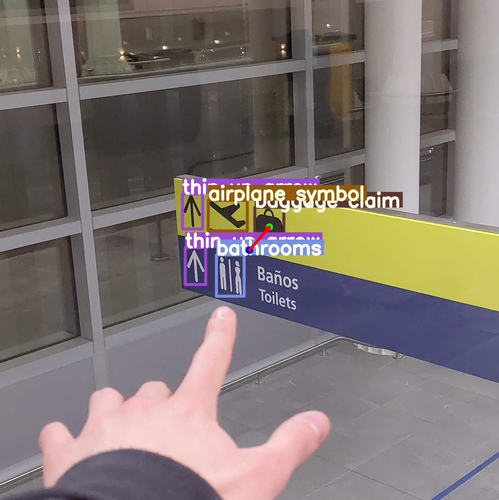
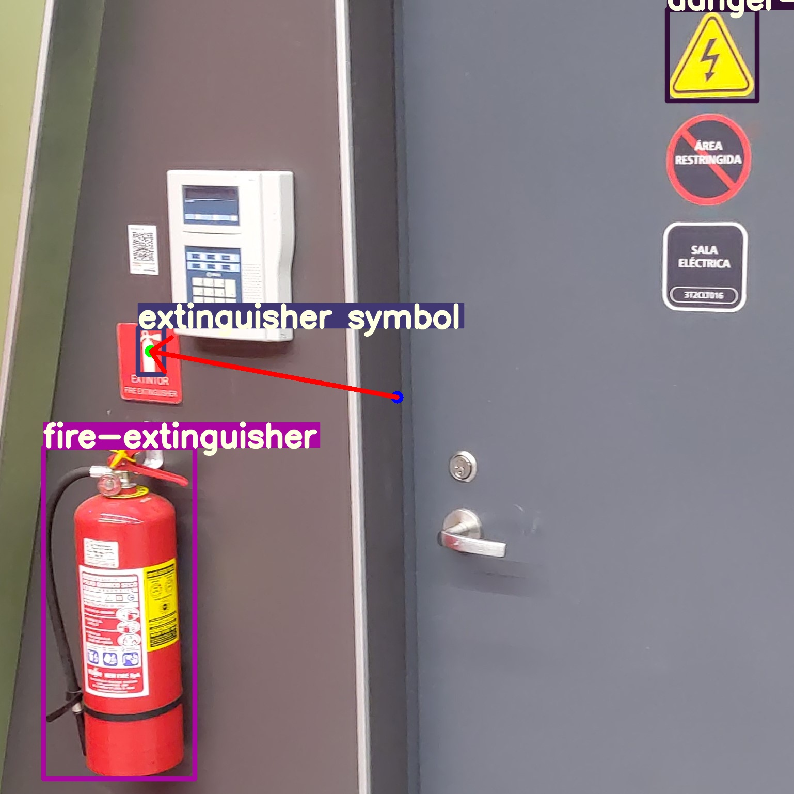
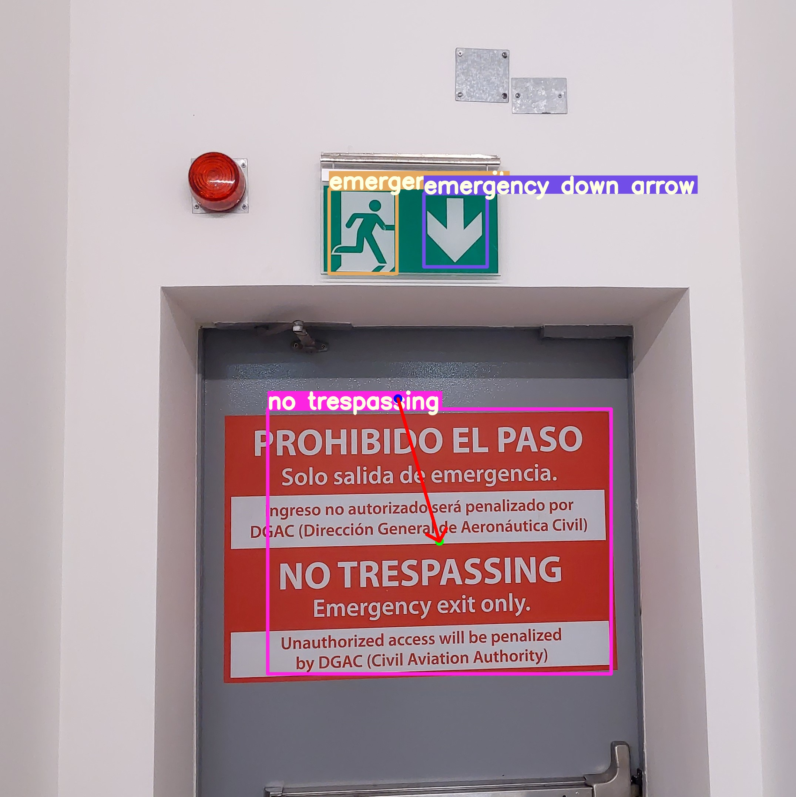
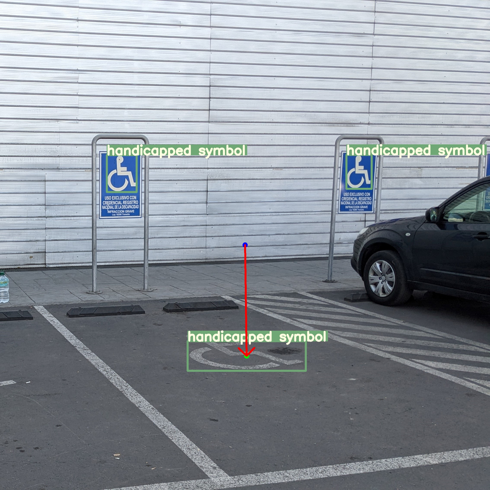
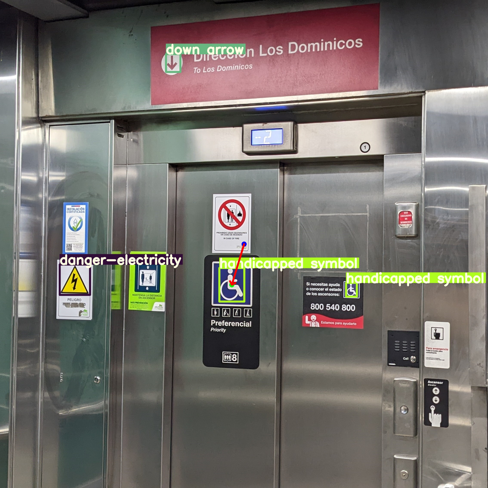
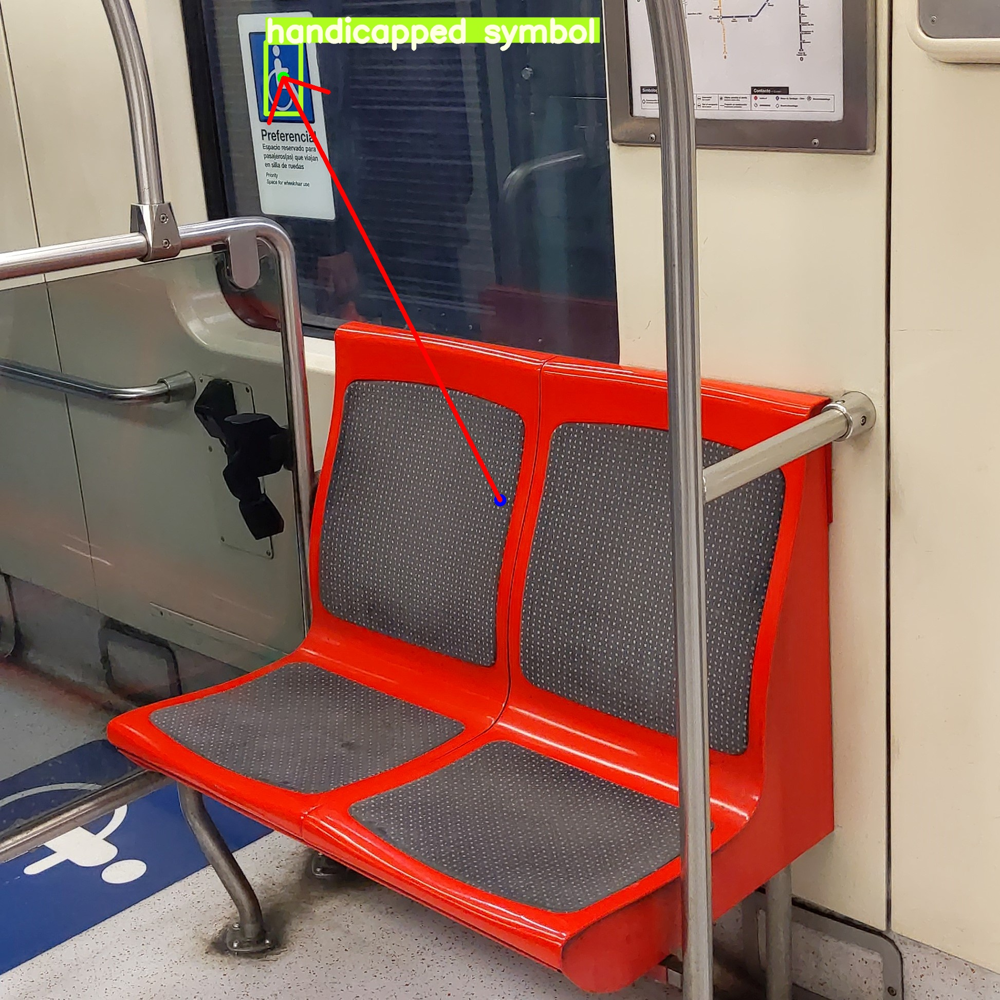
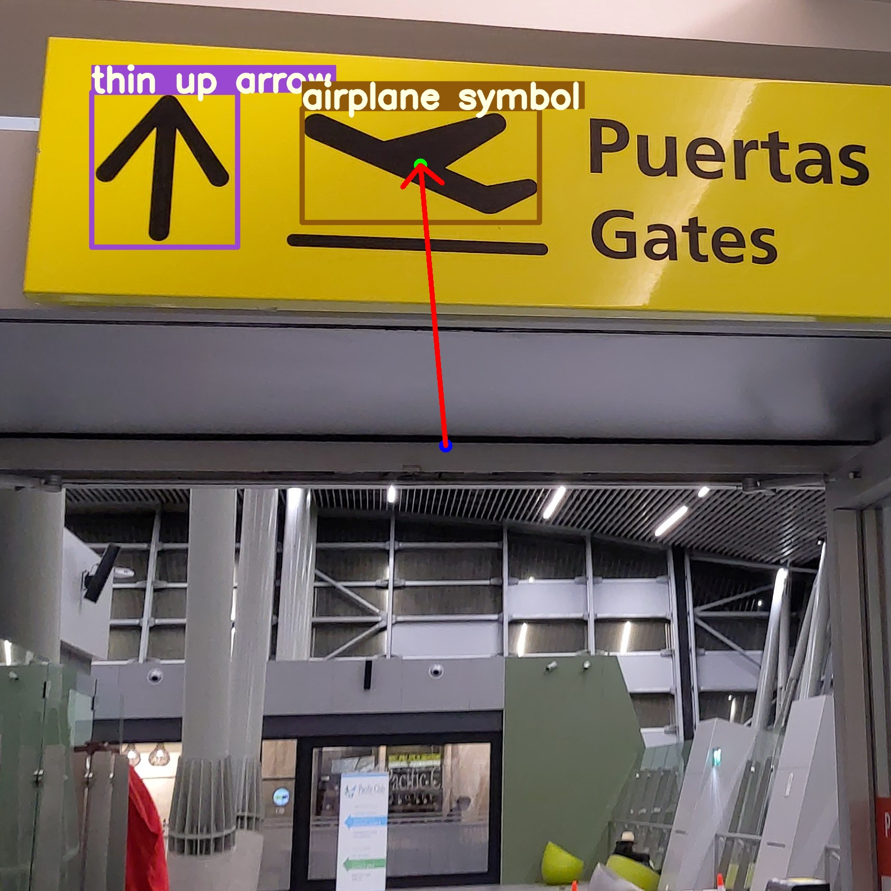
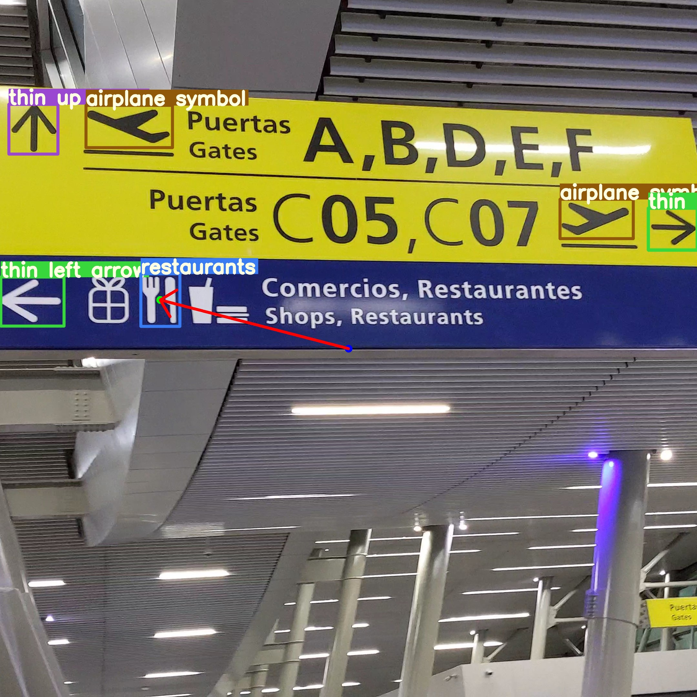
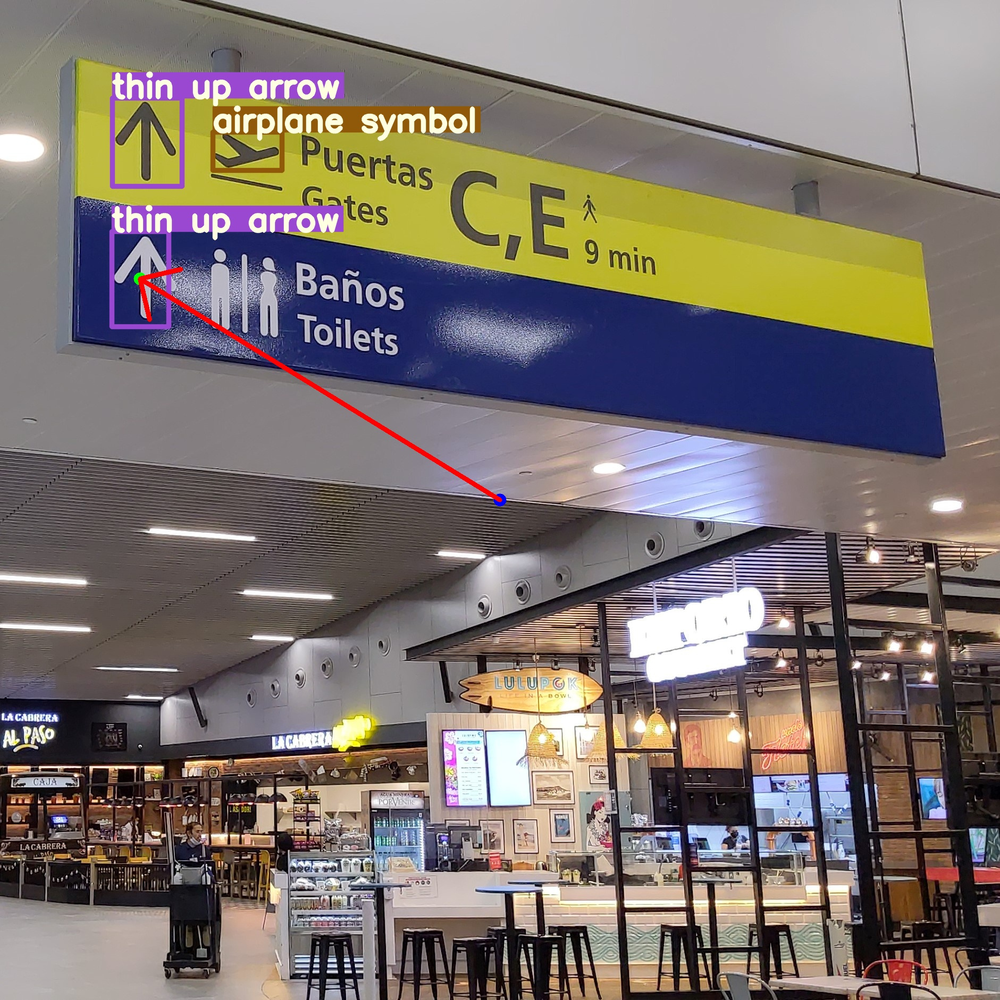
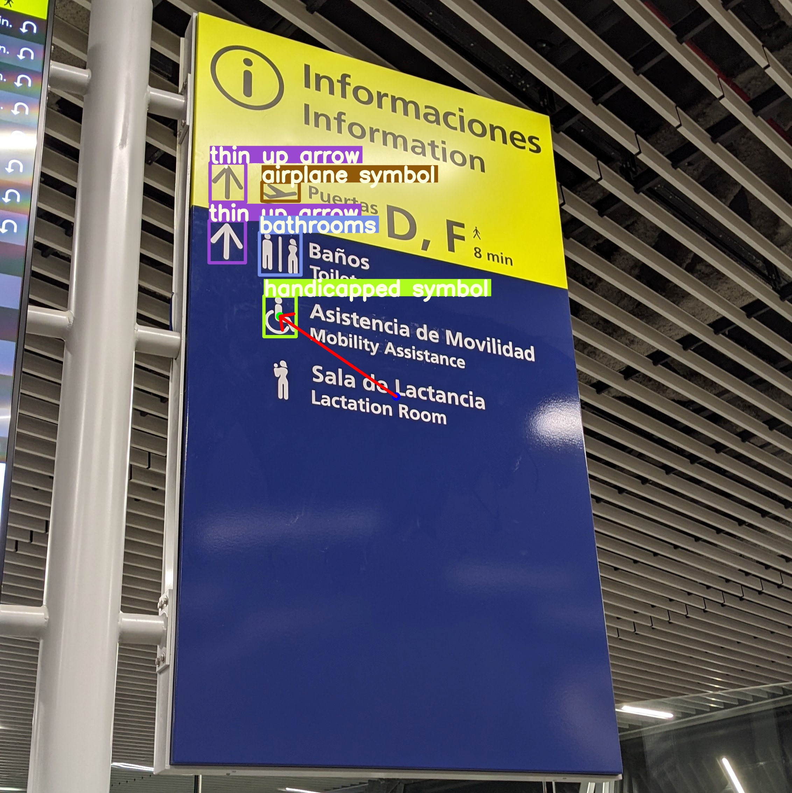

# BVI System 
  
##### Complementary repository to the article: "Development of an Electronic Travel Aid with Artificial Intelligence for Blind People in Public Areas"

[Manuscript Information (CAIS-D-23-00812).pdf](https://github.com/NicoGitSoft/BVI/files/12678844/Manuscript.Information.CAIS-D-23-00812.pdf)

## Description
This repocitorio aims to present the files that were used for the development of the thesis "Development of an Electronic Travel Aid with Artificial Intelligence for Blind People in Public Areas" of the University of Santiago, Chile (Usach).

###### Author: Nicolás Ibáñez Rojas
###### E-mail: nicolas.ibanez.r@usach.cl


## Organization of this repository
In the folder `Scripts` you can find all the programming codes used. The folder `Arduino` contains the programs related to the Atmega328P microcontroller, and in the folder `Notebooks` you can find the Colab notebooks used to train the YOLOv5n, YOLOv7t, YOLOv7s, and YOLOv8n models with the set of public indoor signage images present in the `Dataset` folder. In the folder `Models/Sings` you will find the files with the already trained weights of the YOLO models in PyTorch, OpenVINO, and ONNX formats, along with their respective configurations in JSON and XML formats. Finally, in the folder `Models/Hands`, you can find the Palm Detection and HandLandmark models in OpenVINO format (.blob) to use directly on the OAK-D device.

## Illustrations


## Test images
   

   

   

## System diagram


## System circuit


## BVI-DATASET description

BVI-DATASET contains some of the most frequent signage in airports, subways and shopping malls. Available at ROBOFLOW (link [here](https://app.roboflow.com/generic-signage/airports-ans-subways/7))


## Requirements using Raspberry Pi OS (64-bits)
```
PATH=$PATH:/home/pi/.local/bin
sudo pip install mediapipe pyserial scipy protobuf==3.20.* 
sudo apt install speech-dispatcher curl git
sudo curl -fL https://docs.luxonis.com/install_dependencies.sh | bash
pip install --extra-index-url https://artifacts.luxonis.com/artifactory/luxonis-python-snapshot-local/ depthai
git clone https://github.com/NicoGitSoft/BVI-TEST.git
```
