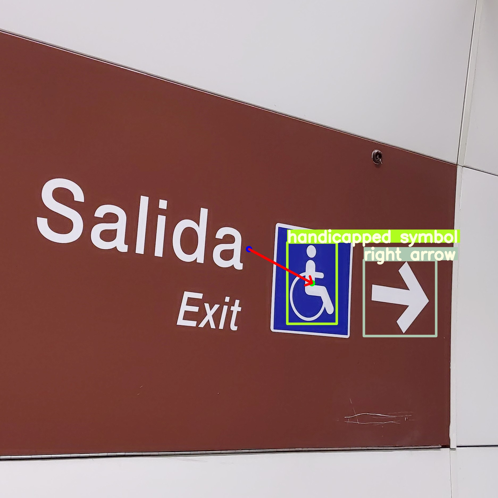

## Development of a visual assistance system for blind people based on artificial intelligence

 


This repocitorio aims to present the files that were used for the development of the paper "A development of an Artificial Intelligence based blind vision system for blind people" (In process of publication).

### Illustrations


   

   

   


### BVI-DATASET description

BVI-DATASET contains some of the most frequent signage in airports, subways and shopping malls.

### Requirements
```
sudo apt install speech-dispatcher
sudo curl -fL https://docs.luxonis.com/install_dependencies.sh | bash
pip install --extra-index-url https://artifacts.luxonis.com/artifactory/luxonis-python-snapshot-local/ depthai
pip intall pyserial
pip install scipy
```
